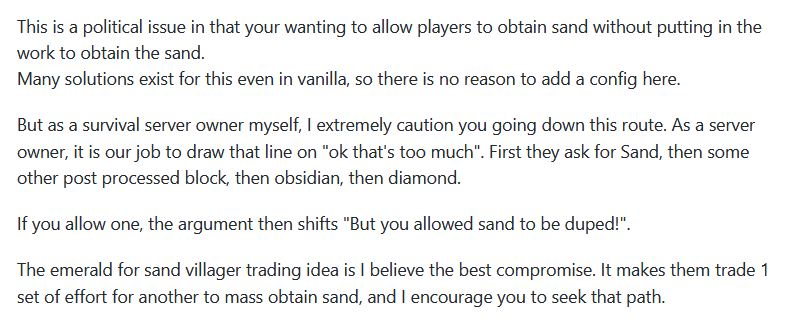

# Inf 1.16 快速说明(已过时)

在我们的服务器升级 1.16 以后，有玩家反馈刷沙机、基岩破坏等机制无法像原版一样正常运作。

在回答玩家的关切之前，Inf 在此澄清立场：我们使用 Paper 作为服务端是基于性能和插件支持（暂时不适用 Fabric 的原因）考虑，但是我们尽量保证服务器**给玩家以贴近原版的体验**。

而从 GitHub 有关[讨论串](https://github.com/PaperMC/Paper/issues/3724)的对话（英文）来看，Paper 的立场并不是这样：他们重新定义了生存的意义（归结来说就是**有限的**资源和能力等），因此他们一直坚持修复物品/方块复制以及某些方块的破坏机制，而**不为管理者提供开关配置**。服务器升级后采用了最新版本的 Paper，而它正积极阻止上述玩家行为的发生，这**也许就是服务器近日表现性能不稳定以及无法操作刷沙机等机器的原因**。

“这是一个政治问题，因为你希望允许玩家在不劳而获地获得沙子。 即使在原版中也有许多解决方案，因此没有理由在此处添加配置。 但是作为我自己的生存服务器所有者，我非常警告你选择这条路。\
&#x20;作为服务器所有者，我们的工作是在‘什么是过分的’上划清界限。 首先，他们要求使用沙子，然后再要求其他一些处理过的方块，然后是黑曜石，然后是钻石。 如果你最初允许沙子复制，则该争论点将转换为‘既然你已经允许复制沙子！’。 \
相信用绿宝石和村民交易沙子的想法是最好的折衷方案。 这使他们以另一套努力换取大量沙子，我鼓励你寻求这条路。”\
——Aikar

我们最终决定尝试在 Inf 上还原原版中的这些特性，但是请玩家留意：**我们并不是站在与 Aikar 相反的立场（即“允许复制”）上这样做，而是站在“原版体验”的立场**。这点是这个说明里需要传达给各位玩家的。

对于 Inf 这样的使用场景来看，Paper 和我们的理念似乎有所差别。不少管理或玩家也曾提出 Fabric 服务器加优化 mod 等方案来实现更接近原版和更好的游戏体验。事实上，有些解决方案相比现在的 Paper 好太多了，但是因为我们始终依靠一个插件——CoreProtect 来记录玩家行为，**其他服务端此类插件/mod 的缺乏最终阻止我们转向它们**。

作为一个快速回应，我们就写到这里。本人文笔水平有限，请多谅解。截止到现在，服务器应该已经对服务端进行相应的修补。
